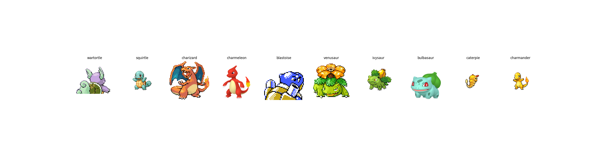

# 🎯 Pokemon Image Classification Project

A machine learning pipeline for Pokemon image classification - currently in development.



## 📋 Project Status

This project is **actively under development** and implements the foundational components for Pokemon image classification:

✅ **Completed:**
- Data fetching and storage pipeline
- PostgreSQL database with Pokemon metadata
- Dataset creation using Hugging Face datasets
- Docker-based development environment

🚧 **In Progress:**
- Vision Transformer (ViT) training scripts
- Model evaluation and metrics
- Training pipeline optimization

🔮 **Planned:**
- Trained model artifacts
- Explainable AI with LIME
- Model performance analysis
- Inference API

## 🏗️ Current Architecture

```
┌─────────────────┐    ┌─────────────────┐    ┌─────────────────┐
│   Data Fetcher  │ -> │    PostgreSQL   │ -> │Dataset Creator  │
│  (pkmn-fetcher) │    │   (postgres)    │    │(pkmn-dataset)   │
└─────────────────┘    └─────────────────┘    └─────────────────┘
       ✅                      ✅                      ✅
```

## 🚀 Available Services

### 1. **PostgreSQL Database** (`postgres`)
- Stores Pokemon metadata and image paths
- Health checks and data persistence
- **Status**: ✅ Fully functional

### 2. **Data Fetcher** (`pkmn-fetcher`)
- Fetches Pokemon data from external APIs
- Downloads and organizes images
- Populates database with metadata
- **Status**: ✅ Working
- **Technologies**: Python, psycopg2

### 3. **Dataset Creator** (`pkmn-dataset`)
- Queries Pokemon data using SQLAlchemy
- Creates Hugging Face datasets with image loading
- Implements train/test splits
- **Status**: ✅ Recently completed
- **Technologies**: datasets[vision], pandas, SQLAlchemy, uv

### 4. **Model Training** (`pkmn-classification`) 
- Vision Transformer training scripts
- Evaluation and metrics collection
- **Status**: 🚧 Under development
- **Technologies**: transformers, torch, scikit-learn

## 📊 Current Dataset

**Available**: ~1000+ Pokemon images across multiple species
**Format**: Hugging Face datasets with automatic image loading  
**Storage**: Local `pokemon_dataset_hf/` directory
**Database**: Metadata stored in PostgreSQL

## 🐳 Docker Setup

| Service | Status | Purpose | Command |
|---------|--------|---------|---------|
| `postgres` | ✅ | Database | `docker compose up postgres` |
| `pkmn-fetcher` | ✅ | Data retrieval | `docker compose --profile setup up` |
| `pkmn-dataset` | ✅ | Dataset creation | `docker compose --profile dataset up` |

## 🛠️ Quick Start

### 1. Setup Database & Fetch Data
```bash
# Start PostgreSQL and fetch Pokemon data
docker compose --profile setup up --build
```

### 2. Create Dataset  
```bash
# Create Hugging Face dataset (just completed!)
docker compose --profile dataset up --build
```

This will create a `pokemon_dataset_hf/` directory with:
- Train/test splits
- Pokemon image data
- Label mappings
- Dataset metadata

## 🔧 Technical Features

**Modern Development Stack:**
- **🚀 Fast Package Management**: Uses `uv` for 5-10x faster Docker builds
- **🐳 Docker Compose**: Microservices architecture  
- **📊 SQLAlchemy**: Modern database operations
- **📦 HuggingFace Datasets**: Industry-standard ML data handling
- **🗃️ PostgreSQL**: Robust metadata storage

## 📁 Current Directory Structure

```
pokedex/
├── pkmn-data-retrieval/     # ✅ Data fetching service
├── pkmn-dataset/           # ✅ Dataset creation service  
├── pkmn-classification/    # 🚧 Training scripts (in progress)
├── pkmn-data-images/       # ✅ Downloaded Pokemon images
├── pokemon_dataset_hf/     # ✅ Generated HuggingFace dataset
└── docker-compose.yaml     # ✅ Service orchestration
```

## 🧪 Technology Choices

| Component | Technology | Reason |
|-----------|------------|--------|
| **Database** | PostgreSQL | Reliable, well-supported |
| **Containerization** | Docker | Reproducible environments |
| **Package Management** | uv | Fast, modern Python packaging |
| **ML Datasets** | HuggingFace | Industry standard |
| **ML Framework** | PyTorch + Transformers | Planned for ViT |

## 📝 Current Usage

```bash
# Available now:
docker compose up postgres                    # Database
docker compose --profile setup up            # Fetch data
docker compose --profile dataset up          # Create dataset

# Coming soon:
docker compose --profile train up            # Model training
docker compose --profile inference up        # Model inference
```

## 🎯 Next Steps

1. **Complete ViT training pipeline** - Finish model training scripts
2. **Model evaluation** - Comprehensive metrics and analysis  
3. **Trained model artifacts** - Save and version trained models
4. **Performance analysis** - Accuracy, confusion matrices, etc.
5. **Explainable AI** - LIME explanations for predictions
6. **Inference API** - REST API for real-time predictions

## 🚧 Development Notes

This is an **educational/experimental project** exploring modern MLOps practices:
- Clean microservices architecture
- Reproducible ML pipelines  
- Modern Python packaging with `uv`
- Docker-based development workflow

**Contributions and suggestions welcome!** This is a learning project focusing on best practices in ML engineering.

---

**Building step by step! 🚀**