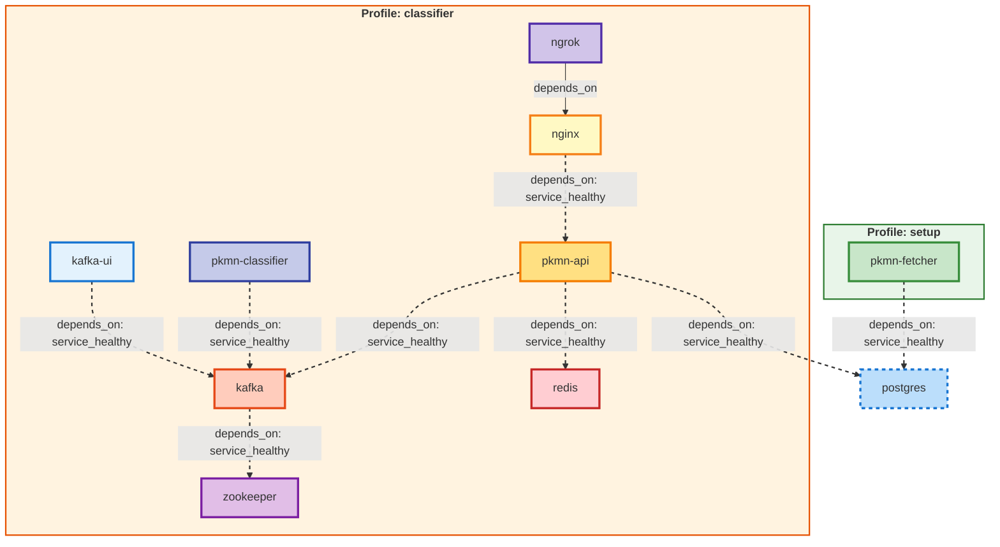
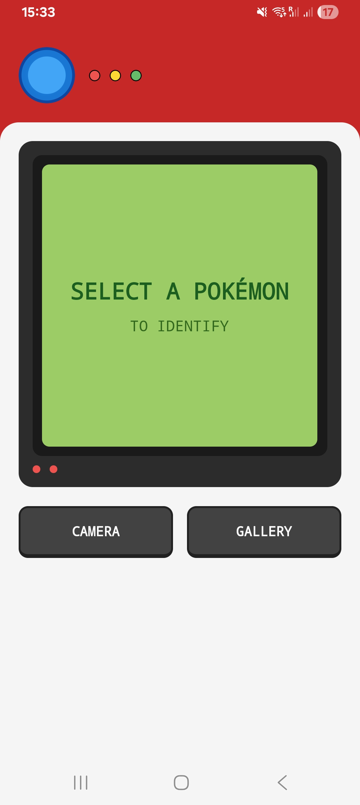
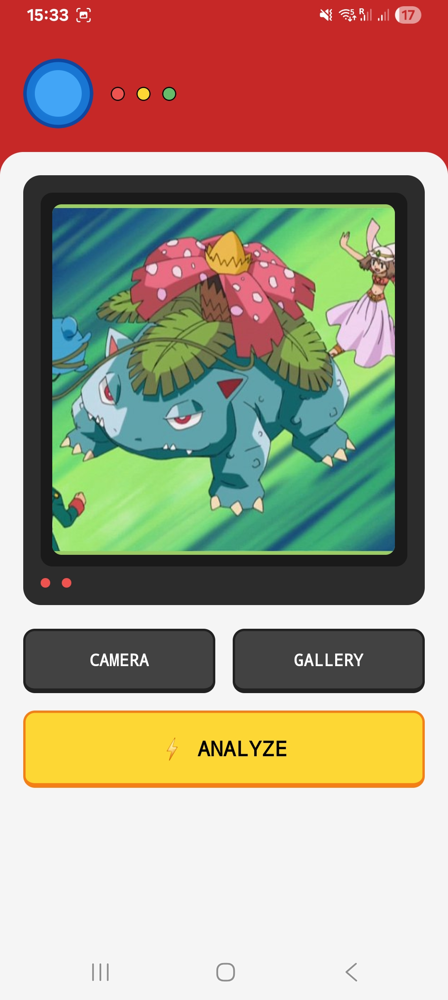
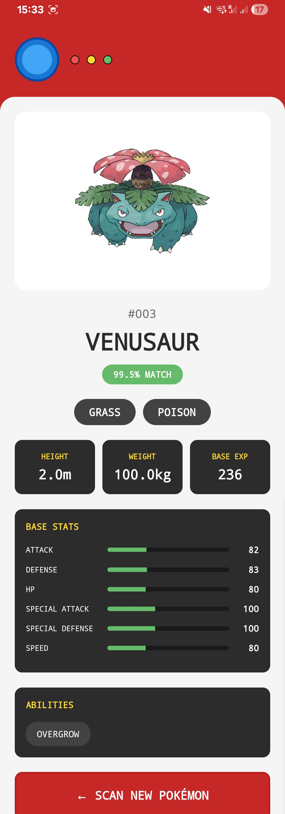

# Pokédex – AI Pokémon Classifier

AI-powered Pokémon classifier with mobile app. Snap a photo to identify Pokémon species. Features: React Native Pokédex UI, FastAPI backend, Kafka messaging, Vision Transformer ML model, complete stats & artwork. Microservices architecture with Docker.




## 🎯 What It Does

Point your phone camera at any Pokémon → instantly get identification with stats, types, abilities, artwork, and more.

## 📸 Screenshots

| Home Screen | Scanning | Results |
|-------------|----------|---------|
|  |  |  |

## 🏗️ Architecture

A microservices-based system designed for scalability and maintainability.

- **📱 Mobile App** – React Native (iOS + Android)
- **🌐 Backend API** – FastAPI
- **🧠 ML Classifier** – ViT (Vision Transformer) via Transformers & PyTorch
- **🗄️ Database** – PostgreSQL
- **⚡ Message Broker** – Kafka
- **🔥 Cache** – Redis
- **📊 Monitoring** – Kafka UI

## 📦 Components

| Component       | Technology                 | Port         | Status |
|----------------|----------------------------|---------------|--------|
| Mobile App     | React Native + Expo        | –             | ✅     |
| API Gateway    | FastAPI                    | 8000          | ✅     |
| ML Classifier  | Transformers (ViT)         | –             | ✅     |
| Message Broker | Apache Kafka + Zookeeper   | 29092 / 2181  | ✅     |
| Database       | PostgreSQL                 | 5432          | ✅     |
| Cache          | Redis (encrypted)          | 6379          | ✅     |
| Reverse Proxy  | Nginx                      | 80            | ✅     |
| Tunnel         | ngrok                      | –             | ✅     |
| Monitoring     | Kafka UI                   | 8080          | ✅     |

## 🎮 Features

- 📸 Camera & gallery photo upload  
- 🤖 ML-powered classification  
- 📊 Complete Pokémon stats (types, abilities, height, weight)  
- 🎨 Official artwork display  
- ⚡ Real-time processing with Kafka  
- 🔒 50% confidence threshold  
- 🔐 Encrypted data at rest (Redis)
- 🌐 Public API access via ngrok tunnel
- 🧭 Classic Pokédex-style UI  

## 🚀 Quick Start

### Prerequisites

- Docker & Docker Compose
- Node.js 24+ (for mobile app)
- Expo Go app on your phone
- **Python 3.x with cryptography library** (for key generation)
- **ngrok account** (free tier works)

### 0. Generate Encryption Key (First Time Only)

Before starting the backend, you need to generate an encryption key:

```bash
# Install cryptography locally
pip install cryptography

# Generate encryption key
cd pkmn-api/src
python generate_key.py

# This creates a .env file with ENCRYPTION_KEY
```

**Note:** The encryption key is used to encrypt data at rest in Redis. Without it, the API will fail to start.

### 1. Setup Database & Fetch Pokémon Data

```bash
# Start PostgreSQL and fetch Pokemon data (~30-45 min for all 1000+ Pokemon)
docker-compose --profile setup up

# This fetches all Pokemon with 0.5s delay between requests (polite to PokeAPI)
```

This will create database tables and fetch 1000+ Pokémon from PokeAPI with sprites and metadata.

### 2. Configure ngrok

```bash
# Add your ngrok auth token to .env file in project root
echo "NGROK_AUTHTOKEN=your_token_here" >> .env

# Get your token from: https://dashboard.ngrok.com/get-started/your-authtoken
```

### 3. Start Backend Services

```bash
# Start all backend services
docker-compose --profile classifier up

# Services started:
# ✓ PostgreSQL (5432)
# ✓ Zookeeper (2181)
# ✓ Kafka (29092) 
# ✓ Redis (6379)
# ✓ FastAPI (8000)
# ✓ ML Classifier
# ✓ Kafka UI (8080)
# ✓ Nginx (80)
# ✓ ngrok - public tunnel
```

### 4. Get Your Public URL

```bash
# Check ngrok logs for your public URL
docker logs ngrok

# Look for: https://your-random-url.ngrok-free.app
```

### 5. Setup & Run Mobile App

```bash
cd pkmn-mobile

# Install dependencies
npm install --legacy-peer-deps

# Update API_URL in App.tsx with your ngrok URL
# Example: const API_URL = 'https://your-random-url.ngrok-free.app';

# Start Expo
npx expo start -c --tunnel

# Scan QR code with Expo Go app on your phone
```

## 📱 Mobile App

The mobile application is built with React Native + Expo.

### Features

- Camera integration
- Real-time image recognition
- Detailed Pokémon info pages

## 🌐 API

Backend built with FastAPI, accessible via ngrok tunnel.

### Endpoints

| Method | Endpoint | Description |
|--------|----------|-------------|
| POST   | /classify-pokemon/ | Upload image for classification |
| GET    | /result/{request_id} | Retrieve classification result |
| GET    | /health | Health check |

**Documentation:**
- ReDoc: `https://your-ngrok-url/pkmn-api/docs`
- Swagger: `https://your-ngrok-url/pkmn-api/swagger`
- Kafka Monitor: `https://your-ngrok-url/`

## 🔐 Security Features

- **Encrypted Redis Cache** - All classification results encrypted at rest using Fernet (AES-128)
- **Rate-Limited PokeAPI Access** - 0.5s delay between requests
- **Restart Limits** - Services limited to 3 restart attempts
- **Compressed Images** - Auto-compressed to 800x800 max
- **Health Checks** - All services monitored

## 🧠 Machine Learning Classifier

Powered by Transformers ViT.

### Model Details

- **Model:** `skshmjn/Pokemon-classifier-gen9-1025`
- **Architecture:** Vision Transformer encoder
- **Training Data:** 1000+ Pokémon across all generations
- **Inference Time:** 2-3 seconds per image
- **Confidence Threshold:** 50% (returns "Unknown" below)

## 📊 Database

PostgreSQL, with tables for:

- pokemon (basic info: height, weight, base XP)
- images (sprites & official artwork URLs)
- stats (HP, Attack, Defense, etc.)
- abilities (regular & hidden)
- moves (with learn methods)
- types (Fire, Water, etc.)

## 🔧 Development Tools

- **Docker** - Containerization
- **Docker Compose** - Multi-service orchestration with profiles
- **ngrok** - Secure tunnel to localhost (v3)
- **Nginx** - Reverse proxy
- **Kafka** - Message broker for async processing
- **Redis** - Encrypted result caching
- **uv** - Fast Python package installer (10-100x faster than pip)
- **Kafka UI** - Message monitoring at `http://localhost:8080`

## 🐛 Common Issues

- **Mobile won't connect** → Verify ngrok URL in `App.tsx` matches `docker logs ngrok`
- **No encryption key** → Run `python pkmn-api/src/generate_key.py`
- **Model slow first time** → Downloads ~400 MB model cache from HuggingFace
- **Expo errors** → Use Node 24+, run `npm install --legacy-peer-deps`
- **Image too large** → Auto-compressed to 800×800 max
- **Kafka fails to start** → Wait 90s for startup, auto-restarts enabled
- **Port already in use** → Check if services already running: `docker ps`

## 📄 License

See LICENSE.

## 🙏 Credits

- **PokeAPI** – Pokémon data and stats ([https://pokeapi.co/](https://pokeapi.co/))
- **ML Model** – [skshmjn/Pokemon-classifier-gen9-1025](https://huggingface.co/skshmjn/Pokemon-classifier-gen9-1025) (Vision Transformer fine-tuned for Gen 9 Pokémon, Apache-2.0 License)

---

**⭐ Star this repo if you found it helpful!**
