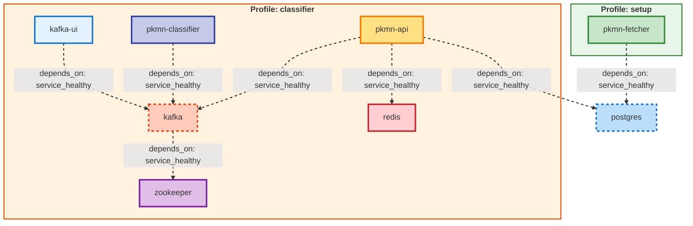

# Pokédex – AI Pokémon Classifier

Full-stack Pokémon identification system with mobile app, ML classifier, and complete Pokédex data.




## 🎯 What It Does

Point your phone camera at any Pokémon → instantly get identification with stats, types, abilities, artwork, and more.

## 📸 Screenshots

| Home Screen | Scanning | Results |
|-------------|----------|---------|
|  |  |  |

## 🏗️ Architecture

A microservices-based system designed for scalability and maintainability.

- **📱 Mobile App** – React Native (iOS + Android)
- **🌐 Backend API** – FastAPI
- **🧠 ML Classifier** – ViT (Vision Transformer) via Transformers & PyTorch
- **🗄️ Database** – PostgreSQL
- **⚡ Message Broker** – Kafka
- **🔥 Cache** – Redis
- **📊 Monitoring** – Kafka UI

## 📦 Components

| Component       | Technology                 | Port         | Status |
|----------------|----------------------------|---------------|--------|
| Mobile App     | React Native + Expo        | –             | ✅     |
| API Gateway    | FastAPI                    | 8000          | ✅     |
| ML Classifier  | Transformers (ViT)         | –             | ✅     |
| Message Broker | Apache Kafka + Zookeeper   | 29092 / 2181  | ✅     |
| Database       | PostgreSQL                 | 5432          | ✅     |
| Cache          | Redis                      | 6379          | ✅     |
| Monitoring     | Kafka UI                   | 8080          | ✅     |

## 🎮 Features

- 📸 Camera & gallery photo upload  
- 🤖 ML-powered classification  
- 📊 Complete Pokémon stats (types, abilities, height, weight)  
- 🎨 Official artwork display  
- ⚡ Real-time processing with Kafka  
- 🔒 50% confidence threshold  
- 🧭 Classic Pokédex-style UI  

## 🚀 Quick Start

### Prerequisites

- Docker & Docker Compose
- Node.js 24+ (for mobile app)
- ngrok (for mobile connectivity)
- Expo Go app on your phone
- **Python 3.x with cryptography library** (for key generation)

### 0. Generate Encryption Key (First Time Only)

Before starting the backend, you need to generate an encryption key:

```bash
# Install cryptography locally
pip install cryptography

# Generate encryption key
cd pkmn-api/src
python generate_key.py

# This creates a .env file with ENCRYPTION_KEY
```

**Note:** The encryption key is used to encrypt data at rest in Redis. Without it, the API will fail to start.

### 1. Setup Database & Fetch Pokémon Data

```bash
# Start PostgreSQL and fetch Pokemon data (~30-45 min)
docker-compose --profile setup up
```

This will create database tables and fetch 1000+ Pokémon from PokeAPI with sprites and metadata.

### 2. Start Backend Services

```bash
# Start all backend services
docker-compose --profile classifier up

# Services started:
# ✓ PostgreSQL (5432)
# ✓ Zookeeper (2181)
# ✓ Kafka (29092)
# ✓ Redis (6379)
# ✓ FastAPI (8000)
# ✓ ML Classifier
# ✓ Kafka UI (8080)
```

### 3. Expose API with ngrok

```bash
# In a new terminal
npx ngrok http 8000

# Copy the HTTPS URL (e.g., https://abc-123.ngrok-free.app)
```

### 4. Setup & Run Mobile App

```bash
cd pkmn-mobile

# Install dependencies
npm install --legacy-peer-deps

# Update API_URL in App.tsx with your ngrok URL

# Start Expo
npx expo start -c --tunnel

# Scan QR code with Expo Go app on your phone
```

## 📱 Mobile App

The mobile application is built with React Native + Expo.

### Features

- Camera integration
- Real-time image recognition
- Detailed Pokémon info pages

## 🌐 API

Backend built with FastAPI.

### Endpoints

| Method | Endpoint | Description |
|--------|----------|-------------|
| POST   | /classify-pokemon/ | Upload image for classification |
| GET    | /result/{request_id} | Retrieve classification result |

Docs: [http://localhost:8000/docs](http://localhost:8000/docs) <br>
Swagger: [http://localhost:8000/swagger](http://localhost:8000/swagger)

## 🧠 Machine Learning Classifier

Powered by Transformers ViT.

### Model Architecture

- Vision Transformer encoder
- Dense layers for classification
- Softmax output across Pokémon species

Trained on a curated Pokémon dataset.

## 📊 Database

PostgreSQL, with tables for:

- pokemon
- images
- stats
- abilities
- moves
- types


## 🔧 Development Tools

- Docker for containerization
- Docker Compose for local orchestration
- ngrok for exposing API to the mobile app
- Kafka for distributing classification tasks
- Redis for result caching

## 🐛 Common Issues

- Mobile won't connect → Update the ngrok URL in `App.tsx`  
- Model slow first time → Downloads ~400 MB model cache  
- Expo errors → Use Node 24+, run `npm install --legacy-peer-deps`  
- Image too large → Auto-compressed to 800×800  

## 📄 License

See LICENSE.

## 🙏 Credits

- **PokeAPI** – Pokémon data and stats  
- **ML Model** – [skshmjn/Pokemon-classifier-gen9-1025](https://huggingface.co/skshmjn/Pokemon-classifier-gen9-1025) (Vision Transformer fine-tuned for Gen 9 Pokémon, Apache-2.0 License)
