# Pokemon Classifier Mobile App

React Native Expo app for Pokemon classification with a classic Pokédex design.

```mermaid
  graph TD
  subgraph Profile_setup[<b>Profile: setup</b>]
    postgres["postgres<br/>(setup, classifier, dataset)"]:::custom_postgres
    pkmn-fetcher:::custom_pkmn-fetcher
  end
  subgraph Profile_classifier[<b>Profile: classifier</b>]
    postgres["postgres<br/>(setup, classifier, dataset)"]:::custom_postgres
    zookeeper:::custom_zookeeper
    kafka:::custom_kafka
    redis:::custom_redis
    pkmn-api:::custom_pkmn-api
    pkmn-classifier:::custom_pkmn-classifier
    kafka-ui:::custom_kafka-ui
  end
  subgraph Profile_dataset[<b>Profile: dataset</b>]
    postgres["postgres<br/>(setup, classifier, dataset)"]:::custom_postgres
    pkmn-dataset:::custom_pkmn-dataset
  end
  pkmn-fetcher -->|depends_on: service_healthy| postgres
  pkmn-dataset -->|depends_on: service_healthy| postgres
  kafka -->|depends_on: service_healthy| zookeeper
  pkmn-api -->|depends_on: service_healthy| postgres
  pkmn-api -->|depends_on: service_healthy| kafka
  pkmn-api -->|depends_on: service_healthy| redis
  pkmn-classifier -->|depends_on: service_healthy| kafka
  kafka-ui -->|depends_on: service_healthy| kafka
  classDef profileService fill:#FFF9C4,stroke:#F57F17,stroke-width:2px;
  classDef multiProfileService fill:#FFE082,stroke:#E65100,stroke-width:3px,stroke-dasharray: 5 5;
  classDef custom_postgres fill:#BBDEFB,stroke:#1976D2,stroke-width:3px,stroke-dasharray: 5 5;
  classDef custom_pkmn-fetcher fill:#C8E6C9,stroke:#388E3C,stroke-width:3px;
  classDef custom_pkmn-dataset fill:#B2DFDB,stroke:#00796B,stroke-width:3px;
  classDef custom_zookeeper fill:#E1BEE7,stroke:#7B1FA2,stroke-width:3px;
  classDef custom_kafka fill:#FFCCBC,stroke:#E64A19,stroke-width:3px,stroke-dasharray: 5 5;
  classDef custom_redis fill:#FFCDD2,stroke:#C62828,stroke-width:3px;
  classDef custom_pkmn-api fill:#FFE082,stroke:#F57C00,stroke-width:3px;
  classDef custom_pkmn-classifier fill:#C5CAE9,stroke:#303F9F,stroke-width:3px;
  classDef custom_kafka-ui fill:#E3F2FD,stroke:#1976D2,stroke-width:3px;
  style Profile_setup fill:#E8F5E9,stroke:#2E7D32,stroke-width:2px
  style Profile_classifier fill:#FFF3E0,stroke:#E65100,stroke-width:2px
  style Profile_dataset fill:#E3F2FD,stroke:#1565C0,stroke-width:2px
  linkStyle 0 stroke:#000000ff,stroke-width:2px,stroke-dasharray:5 5,color:#000000ff
  linkStyle 1 stroke:#000000ff,stroke-width:2px,stroke-dasharray:5 5,color:#000000ff
  linkStyle 2 stroke:#000000ff,stroke-width:2px,stroke-dasharray:5 5,color:#000000ff
  linkStyle 3 stroke:#000000ff,stroke-width:2px,stroke-dasharray:5 5,color:#000000ff
  linkStyle 4 stroke:#000000ff,stroke-width:2px,stroke-dasharray:5 5,color:#000000ff
  linkStyle 5 stroke:#000000ff,stroke-width:2px,stroke-dasharray:5 5,color:#000000ff
  linkStyle 6 stroke:#000000ff,stroke-width:2px,stroke-dasharray:5 5,color:#000000ff
  linkStyle 7 stroke:#000000ff,stroke-width:2px,stroke-dasharray:5 5,color:#000000ff

```



## Prerequisites

- **Node.js 24+** required
- Expo Go app installed on your phone ([iOS](https://apps.apple.com/app/expo-go/id982107779) | [Android](https://play.google.com/store/apps/details?id=host.exp.exponent))
- Docker running backend services

## Setup

1. **Install dependencies:**
   ```bash
   npm install --legacy-peer-deps
   ```

2. **Start Expo dev server:**
   ```bash
   npx expo start -c --tunnel
   ```

3. **Scan QR code:**
   - Open Expo Go on your phone
   - Scan the QR code displayed in terminal
   - Make sure your backend is running

## Backend Setup

Make sure the backend services are running:

```bash
# From project root
docker-compose --profile classifier up
```

And ngrok is exposing the API:

```bash
npx ngrok http 8000
```

Update the API URL in `App.tsx` with your ngrok URL.
